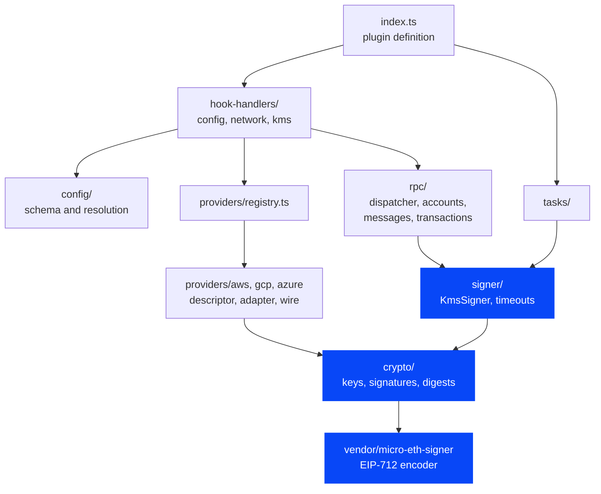
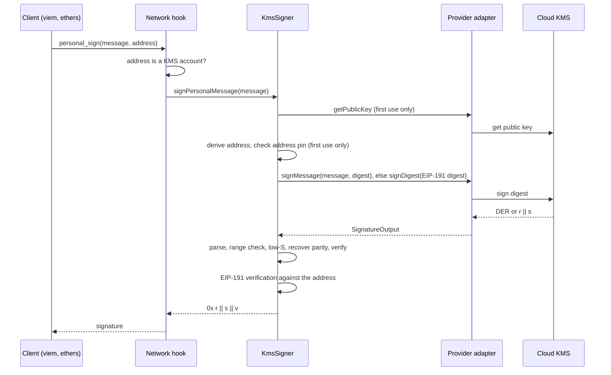
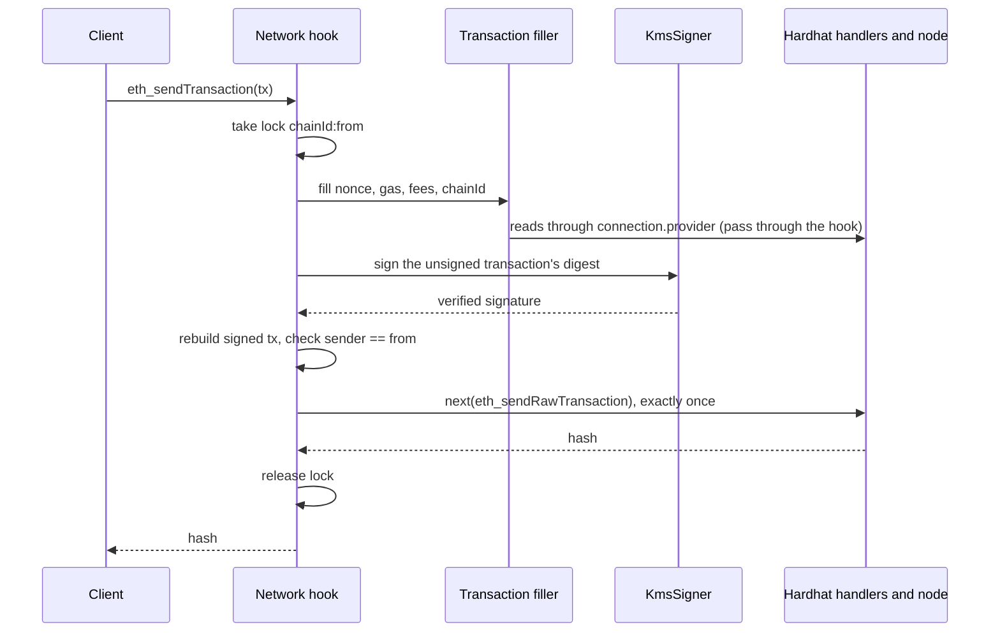

# Architecture

Audience: Contributors and reviewers who want to understand how the code fits together.

Status: M1 ([pull request #4](https://github.com/aelmanaa/hardhat-kms/pull/4)) implements the signing core (`crypto/`, `signer/`, the vendored EIP-712 encoder). The other modules are planned; the code map gives each one's milestone.

## Module map

Each arrow points from a module to a module it may import. Blue modules exist in M1.



The rules behind the arrows:

- `crypto/` is pure: no cloud SDK, no Hardhat runtime, no I/O. Everything in it is testable with vectors and property tests.
- `signer/` owns every check on the signature itself: parsing, low-S, parity recovery and verification. It receives an adapter and never looks one up.
- Adapters translate between the provider's wire format and `SignatureOutput`, and run the provider-specific identity checks listed in [Key identity and pinning](signing-pipeline.md#key-identity-and-pinning). They never decide whether a signature belongs to the key.
- Only provider adapters load a cloud SDK, lazily (see [SDK loading](#sdk-loading)). Provider descriptors, which the config hook handler imports, never import one, so loading a config never loads a cloud SDK.

## Code map

| Concept                          | Where                                                                     | Milestone |
| -------------------------------- | ------------------------------------------------------------------------- | --------- |
| Plugin definition                | `src/index.ts`                                                            | M0        |
| Public keys, signatures, digests | `src/internal/crypto/`                                                    | M1        |
| Signer and adapter interface     | `src/internal/signer/kms-signer.ts`, `src/internal/signer/types.ts`       | M1        |
| Per-call timeout                 | `src/internal/signer/timeout.ts`                                          | M1        |
| Error builder                    | `src/internal/errors.ts`                                                  | M1        |
| Vendored EIP-712 encoder         | `src/internal/vendor/micro-eth-signer/`                                   | M1        |
| Config schema and resolution     | `src/internal/config/`                                                    | M2        |
| Provider registry and `kms` hook | `src/internal/providers/registry.ts`, `src/internal/hook-handlers/kms.ts` | M2        |
| AWS adapter                      | `src/internal/providers/aws/`                                             | M3        |
| GCP and Azure adapters           | `src/internal/providers/{gcp,azure}/`                                     | M6        |
| RPC dispatcher and methods       | `src/internal/rpc/`                                                       | M4, M5    |
| Tasks                            | `src/internal/tasks/`                                                     | M7        |

## Signing a message

A `personal_sign` request for a KMS account reaches the provider only after the signer knows the key's address. The signer checks the returned signature twice before the hook answers. The hook half of this flow is planned for M4; the `KmsSigner` half exists in M1.



## Sending a transaction

An `eth_sendTransaction` from a KMS account is filled, signed and broadcast by the hook while it holds a per-sender lock. This flow is planned for M5.



The rules that keep this safe are in [Request flow and re-entrancy rules](#request-flow-and-re-entrancy-rules) and in [Transactions](transactions.md).

## Goals

hardhat-kms is an MIT-licensed Hardhat 3 plugin that signs transactions and messages with secp256k1 keys held in cloud KMS and HSM services. Version 1 supports three providers:

- AWS KMS
- GCP Cloud KMS
- Azure Key Vault and Azure Managed HSM

The design has three goals:

1. Existing tooling works unchanged. viem, ethers, Ignition and plain scripts see KMS keys as ordinary accounts, because the plugin works at the JSON-RPC layer through a network hook.
2. Parity with Foundry's KMS support, or better. Every Foundry key form and command has an equivalent, and the plugin adds checks Foundry does not have.
3. A new KMS or HSM is one adapter folder plus one line in a registry.

Private key material never leaves the KMS. The plugin sends a 32-byte digest (or, for policy-aware providers, the structured request) and gets a signature back. Every signature is then verified locally before anything uses it.

## Module layout

```
src/
  index.ts                  definePlugin: types, constants, lazy hook/task imports only (Hardhat plugin guideline)
  type-extensions.ts        augments HardhatUserConfig/HardhatConfig (kms) + Http/Edr Network(User)Config (kmsAccounts); no named exports
  types.ts                  public provider-author types (exported via the "hardhat-kms/types" subpath)
  foundry.ts                kmsKeysFromFoundryEnv() (exported via the "hardhat-kms/foundry" subpath)
  internal/
    config/                 zod v3 schema rooted at HardhatUserConfig; conditionalUnionType on `provider`; superRefine for named-key refs
                            (path ["networks", n, "kmsAccounts", i]); pure resolve
    hook-handlers/
      config.ts             validate/resolve (imports provider *descriptors* only)
      network.ts            onRequest / closeConnection
      kms.ts                default handler of the plugin-owned `kms` hook category
    providers/
      registry.ts           provider id -> descriptor; adding a provider = one folder + one line here
      aws/ gcp/ azure/      descriptor.ts (zod schema, resolve, sdk {packageName, range}, display id)
                            adapter.ts (lazy: SDK client, credentials, version pinning)
                            wire.ts (pure decoding: SPKI/PEM/JWK, DER/compact, CRC32C)
    crypto/                 pure, no SDKs: public-key.ts, signature.ts, address.ts, crc32c.ts
    signer/
      key-cache.ts          per-HRE cache: (provider, canonical configured id) -> adapter + public key promise
      kms-signer.ts         signDigest -> {r, s, yParity}: parse -> range -> low-S -> trial recovery -> verify
    rpc/
      dispatcher.ts         request flow (see "Request flow and re-entrancy rules")
      accounts.ts  messages.ts  transactions.ts
      transaction-filler.ts port of Hardhat's built-in fill logic, pinned to an upstream commit
      send-guard.ts         process-global lock + nonce high-water + idempotency cache
    tasks/                  accounts, address, public-key, sign, sign-auth, sign-tx, verify
    vendor/micro-eth-signer/  vendored EIP-712 hashing (MIT, see "Vendored EIP-712")
    errors.ts               allow-listed error builder
    debug.ts                createDebug("hardhat:kms:hook-handlers:…" etc.)
```

The plugin object sets `npmPackage: "hardhat-kms"`. The config hook handler imports provider descriptors only, so loading a config never loads a cloud SDK.

## Request flow and re-entrancy rules

The dispatcher follows these rules. They keep the hook from deadlocking on its own internal calls and make each request's side effects easy to reason about.

1. Pass-through is the default. Only `eth_accounts`, `eth_requestAccounts` and the five signing methods are inspected. Everything else goes straight to `next`, so no allow-list of other methods is needed.
2. `next` is called at most once per request. Every internal RPC call (for example the reads during fill) goes through `connection.provider.request`, which re-enters the hook chain and is passed through by rule 1.
3. Per-HRE initialisation holds a mutex only while it builds plain objects. No I/O happens under that mutex.
4. `eth_sendTransaction` for KMS address `a` on chain `c` takes the process-global lock `c:a`. Inside the lock the code may issue read calls (fill), make any number of KMS signature attempts (retries), and make exactly one `next(eth_sendRawTransaction)`.
5. `eth_signTransaction` takes no lock and never touches the nonce high-water mark, because it never broadcasts.

## Other signing plugins

Hardhat runs dynamically registered handlers first, then plugins in reverse order of the `plugins` array, and its built-in handlers last. Another plugin that intercepts `eth_accounts` or `eth_sendTransaction`, such as `@nomicfoundation/hardhat-ledger`, therefore runs before or after hardhat-kms depending on where each appears in `plugins`. hardhat-kms only acts on addresses it owns and passes everything else on, so both plugins can coexist; an integration test in M4 loads hardhat-kms together with hardhat-ledger to keep it that way.

## Lifetimes and caching

Adapters, SDK clients and public-key promises are cached per HRE, inside the hook-factory closure. Every connection and every test file shares them. The cache key is (provider, canonical configured id after `.get()`), with a secondary index by the resolved ARN or key version.

SDK clients are refcounted by connections. When the count reaches zero, an idle timer (`unref`'d, about 5 s) closes them, and they are re-created lazily on next use. They are never closed from `closeConnection`. GCP uses `{ fallback: true }` (REST) by default, so no gRPC channel keeps `hardhat run` alive. A test checks that `hardhat run` exits.

## Timeouts and retries

One AbortSignal timeout covers each whole KMS call, including the SDK's own retries. The default is 30 s (`kms.defaults.timeoutMs`, overridable per key). For GCP the plugin passes gax `timeout` and `retry` call options, which override the SDK's 600 s default.

Signing has no side effects, so the plugin retries throttling errors and GCP CRC mismatches, at most three times and honouring `Retry-After`.

## SDK loading

The only peer dependency is `hardhat`. Hardhat's peer-dependency checker ignores `peerDependenciesMeta`, so optional peers would not work. Users install the SDK for their provider, as the README documents. The cloud SDKs are devDependencies of the plugin itself.

An SDK is loaded on first use:

1. The plugin resolves the package with `createRequire(<project root>/package.json).resolve(pkg)`. This works with npm, pnpm and Yarn PnP because the user installs the SDK in their own project.
2. It finds the installed version by walking up from the resolved path.
3. It checks the version against the descriptor's `sdk: { packageName, range }` with `semver`, which is a runtime dependency.

A missing or incompatible SDK raises a `HardhatPluginError` containing the exact `npm i` command to fix it.
