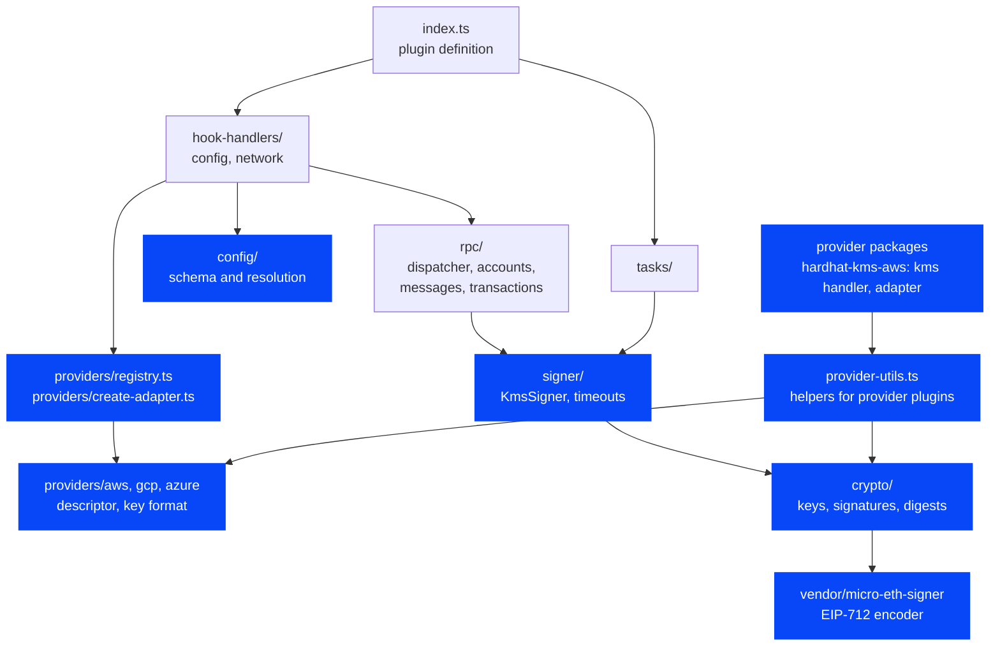
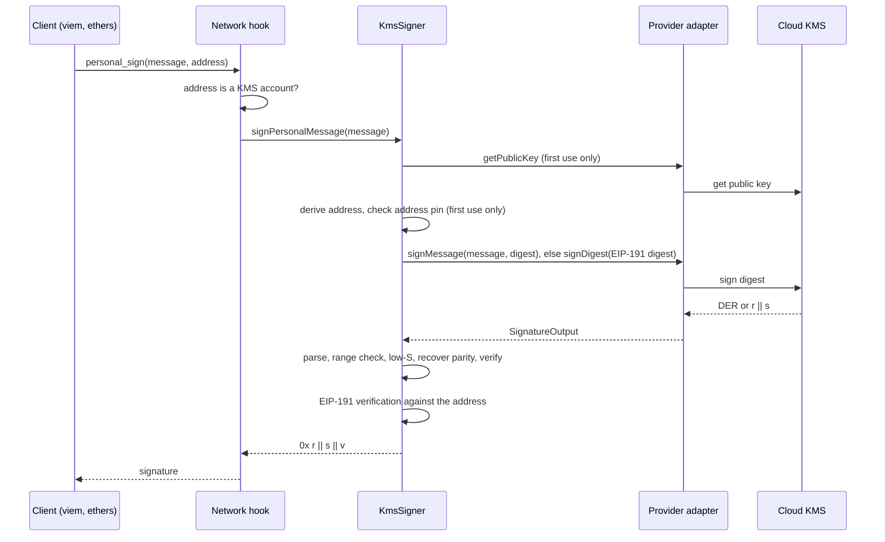
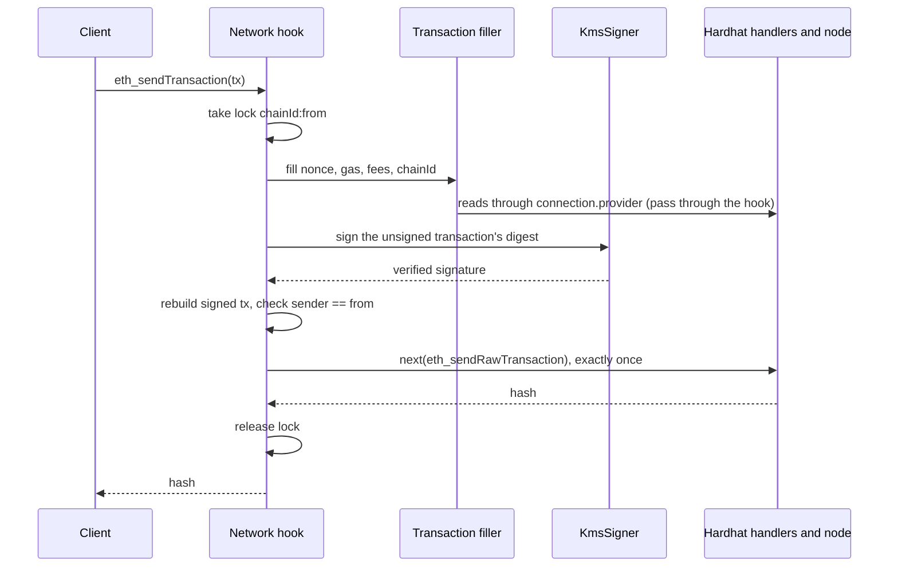

# Architecture

Audience: Contributors and reviewers who want to understand how the code fits together.

Status: M1 implements the signing core (`crypto/`, `signer/`, the vendored EIP-712 encoder). M2 adds `config/`, the built-in providers' descriptors and key formats, the registry and the `kms` hook (`providers/`). M3 adds the AWS adapter, which lives in its own package, `packages/hardhat-kms-aws` ([#91](https://github.com/aelmanaa/hardhat-kms/issues/91)). The other modules are planned; the code map gives each one's milestone.

## Module map

Each arrow points from a module to a module it may import. Blue modules are implemented. All modules are in `packages/hardhat-kms/src/` except the provider packages, which reach the core only through `hardhat-kms/types` and `hardhat-kms/provider-utils`.



The rules behind the arrows:

- `crypto/` is pure: no cloud SDK, no Hardhat runtime, no I/O. Everything in it is testable with vectors and property tests.
- `signer/` owns every check on the signature itself: parsing, low-S, parity recovery and verification. It receives an adapter and never looks one up.
- Adapters translate between the provider's wire format and `SignatureOutput`, and run the provider-specific identity checks listed in [Key identity and pinning](signing-pipeline.md#key-identity-and-pinning). They never decide whether a signature belongs to the key.
- The core depends on no cloud SDK. Each provider package depends on its own SDK and imports it only when it creates an adapter (see [SDK loading](#sdk-loading)), so loading a config never loads a cloud SDK.

## Packages

The repository is a pnpm workspace ([decision 0010](decisions/0010-pnpm-workspaces.md)). Following [decision 0009](decisions/0009-one-package-per-provider.md), each cloud provider has its own package around an SDK-free core:

| Package                                                  | Holds                                                                                                   | Status                                                                 |
| -------------------------------------------------------- | ------------------------------------------------------------------------------------------------------- | ---------------------------------------------------------------------- |
| `packages/hardhat-kms`                                   | The core: config and key formats, signing checks, the `kms` hook, `--kms`, `hardhat-kms/provider-utils` | Implemented                                                            |
| `packages/hardhat-kms-aws`                               | The AWS plugin and adapter, depending on `@aws-sdk/client-kms`                                          | Implemented ([#91](https://github.com/aelmanaa/hardhat-kms/issues/91)) |
| `packages/hardhat-kms-gcp`, `packages/hardhat-kms-azure` | The Google Cloud and Azure adapters                                                                     | Planned (M6)                                                           |

## Code map

| Concept                                    | Where                                                                                                                                                     | Milestone |
| ------------------------------------------ | --------------------------------------------------------------------------------------------------------------------------------------------------------- | --------- |
| Plugin definition                          | `packages/hardhat-kms/src/index.ts`                                                                                                                       | M0        |
| Public keys, signatures, digests           | `packages/hardhat-kms/src/internal/crypto/`                                                                                                               | M1        |
| Signer and adapter interface               | `packages/hardhat-kms/src/internal/signer/kms-signer.ts`, `packages/hardhat-kms/src/internal/signer/types.ts`                                             | M1        |
| Per-call timeout                           | `packages/hardhat-kms/src/internal/signer/timeout.ts`                                                                                                     | M1        |
| Error builder                              | `packages/hardhat-kms/src/internal/errors.ts`                                                                                                             | M1        |
| Vendored EIP-712 encoder                   | `packages/hardhat-kms/src/internal/vendor/micro-eth-signer/`                                                                                              | M1        |
| Config schema and resolution               | `packages/hardhat-kms/src/internal/config/`                                                                                                               | M2        |
| Provider descriptors and registry          | `packages/hardhat-kms/src/internal/providers/{registry,types}.ts`, `packages/hardhat-kms/src/internal/providers/*/descriptor.ts`                          | M2        |
| `kms` hook for provider plugins            | `packages/hardhat-kms/src/internal/providers/create-adapter.ts`, `KmsHooks` in `packages/hardhat-kms/src/types.ts`                                        | M2        |
| Helpers for provider plugins               | `packages/hardhat-kms/src/provider-utils.ts` (`hardhat-kms/provider-utils`)                                                                               | M3        |
| `--kms` option (Foundry's variables)       | `packages/hardhat-kms/src/internal/config/env-keys.ts`, `packages/hardhat-kms/src/internal/hook-handlers/hre.ts`                                          | M2, M4    |
| AWS plugin, `kms` hook handler and adapter | `packages/hardhat-kms-aws/src/index.ts`, `packages/hardhat-kms-aws/src/internal/hook-handlers/kms.ts`, `packages/hardhat-kms-aws/src/internal/adapter.ts` | M3        |
| GCP and Azure adapters                     | `packages/hardhat-kms-gcp/`, `packages/hardhat-kms-azure/` (planned)                                                                                      | M6        |
| RPC dispatcher and methods                 | `packages/hardhat-kms/src/internal/rpc/`                                                                                                                  | M4, M5    |
| Tasks                                      | `packages/hardhat-kms/src/internal/tasks/`                                                                                                                | M7        |

## Signing a message

A `personal_sign` request for a KMS account reaches the provider only after the signer knows the key's address. The signer checks the returned signature twice before the hook answers. The hook half of this flow is planned for M4; the `KmsSigner` half exists in M1.



## Sending a transaction

An `eth_sendTransaction` from a KMS account is filled, signed and broadcast by the hook while it holds a per-sender lock. This flow is planned for M5.



The rules that keep this safe are in [Request flow and re-entrancy rules](#request-flow-and-re-entrancy-rules) and in [Transactions](transactions.md).

## Goals

hardhat-kms is an MIT-licensed Hardhat 3 plugin that signs transactions and messages with secp256k1 keys held in cloud KMS and HSM services. Version 1 supports three providers:

- AWS KMS
- GCP Cloud KMS
- Azure Key Vault and Azure Managed HSM

The design has three goals:

1. Existing tooling works unchanged. viem, ethers, Ignition and plain scripts see KMS keys as ordinary accounts, because the plugin works at the JSON-RPC layer through a network hook.
2. Parity with Foundry's KMS support, or better. Every Foundry key form and command has an equivalent, and the plugin adds checks Foundry does not have.
3. A new KMS or HSM is one provider plugin: a package with a `kms` hook handler and an adapter.

Private key material never leaves the KMS. The plugin sends a 32-byte digest (or, for policy-aware providers, the structured request) and gets a signature back. Every signature is then verified locally before anything uses it.

## Module layout

```
packages/hardhat-kms/src/
  index.ts                  definePlugin: types, constants, lazy hook/task imports only (Hardhat plugin guideline)
  type-extensions.ts        augments HardhatUserConfig/HardhatConfig (kms) + Http/Edr Network(User)Config (kmsAccounts); no named exports
  types.ts                  public provider-author types (exported via the "hardhat-kms/types" subpath)
  provider-utils.ts         helpers for provider plugins (the "hardhat-kms/provider-utils" subpath, @experimental)
  internal/
    config/                 zod v3 schema rooted at HardhatUserConfig; conditionalUnionType on `provider`; superRefine for named-key refs
                            (path ["networks", n, "kmsAccounts", i]); pure resolve
    hook-handlers/
      config.ts             validate/resolve (imports provider *descriptors* only)
      network.ts            onRequest / closeConnection
    providers/
      registry.ts           provider id -> descriptor; a built-in provider = one folder + its types + one entry here
      create-adapter.ts     runs the `kms` hook chain; a key no handler claims fails; checks the adapter
      aws/ gcp/ azure/      descriptor.ts (zod schema, resolve incl. displayId, name, adapter package or tracking issue)
                            config.ts, key-id.ts (pure: key formats and parsing)
    crypto/                 pure, no SDKs: public-key.ts, signature.ts, address.ts, crc32c.ts
    signer/
      key-cache.ts          per-HRE cache: (provider, canonical configured id) -> adapter + public key promise
      kms-signer.ts         signDigest -> {r, s, yParity}: parse -> range -> low-S -> trial recovery -> verify
    rpc/
      dispatcher.ts         request flow (see "Request flow and re-entrancy rules")
      accounts.ts  messages.ts  transactions.ts
      transaction-filler.ts port of Hardhat's built-in fill logic, pinned to an upstream commit
      send-guard.ts         process-global lock + nonce high-water + idempotency cache
    tasks/                  accounts, address, public-key, sign, sign-auth, sign-tx, verify
    vendor/micro-eth-signer/  vendored EIP-712 hashing (MIT, see "Vendored EIP-712")
    errors.ts               allow-listed error builder
    debug.ts                createDebug("hardhat:kms:hook-handlers:…" etc.)
```

The plugin object sets `npmPackage: "hardhat-kms"`. The config hook handler imports provider descriptors only, and no descriptor imports an SDK.

Each provider package has the same small layout. For AWS:

```
packages/hardhat-kms-aws/src/
  index.ts                  definePlugin: id and npmPackage "hardhat-kms-aws", depends on hardhat-kms,
                            lazy `kms` hook handler import; references "hardhat-kms/types" for the config types
  internal/
    hook-handlers/kms.ts    claims `aws` keys, passes other keys to next; imports the adapter and the SDK on first use
    adapter.ts              createAwsKeyAdapter(key, sdk): GetPublicKey, Sign, key spec checks, ARN pinning
```

The Google Cloud and Azure packages (M6) will follow it, with a pure `wire.ts` for their formats (PEM, JWK, compact signatures, CRC32C).

## Request flow and re-entrancy rules

The dispatcher follows these rules. They keep the hook from deadlocking on its own internal calls and make each request's side effects easy to reason about.

1. Pass-through is the default. Only `eth_accounts`, `eth_requestAccounts` and the five signing methods are inspected. Everything else goes straight to `next`, so no allow-list of other methods is needed.
2. `next` is called at most once per request. Every internal RPC call (for example the reads during fill) goes through `connection.provider.request`, which re-enters the hook chain and is passed through by rule 1.
3. Per-HRE initialisation holds a mutex only while it builds plain objects. No I/O happens under that mutex.
4. `eth_sendTransaction` for KMS address `a` on chain `c` takes the process-global lock `c:a`. Inside the lock the code may issue read calls (fill), make any number of KMS signature attempts (retries), and make exactly one `next(eth_sendRawTransaction)`.
5. `eth_signTransaction` takes no lock and never touches the nonce high-water mark, because it never broadcasts.

## Other signing plugins

Hardhat runs dynamically registered handlers first, then plugins in reverse order of the `plugins` array, and its built-in handlers last. Another plugin that intercepts `eth_accounts` or `eth_sendTransaction`, such as `@nomicfoundation/hardhat-ledger`, therefore runs before or after hardhat-kms depending on where each appears in `plugins`. hardhat-kms only acts on addresses it owns and passes everything else on, so both plugins can coexist; an integration test in M4 loads hardhat-kms together with hardhat-ledger to keep it that way.

## Lifetimes and caching

Adapters, SDK clients and public-key promises are cached per HRE, inside the hook-factory closure. Every connection and every test file shares them. The cache key is (provider, canonical configured id after `.get()`), with a secondary index by the resolved ARN or key version.

SDK clients are refcounted by connections. When the count reaches zero, an idle timer (`unref`'d, about 5 s) closes them, and they are re-created lazily on next use. They are never closed from `closeConnection`. GCP uses `{ fallback: true }` (REST) by default, so no gRPC channel keeps `hardhat run` alive. A test checks that `hardhat run` exits.

## Timeouts and retries

One AbortSignal timeout covers each whole KMS call, including the SDK's own retries. The default is 30 s (`kms.defaults.timeoutMs`, overridable per key). For GCP the plugin passes gax `timeout` and `retry` call options, which override the SDK's 600 s default.

Signing has no side effects, so the plugin retries throttling errors and GCP CRC mismatches, at most three times and honouring `Retry-After`.

## SDK loading

Each provider package lists its cloud SDK in `dependencies`: `hardhat-kms-aws` depends on `@aws-sdk/client-kms` `^3.1143.0`. Installing the package installs the SDK. The core depends on no cloud SDK, and `packages/hardhat-kms/test/unit/plugin.test.ts` fails if its `package.json` lists one.

A provider package imports its SDK only when it creates an adapter: its plugin definition registers the `kms` hook handler as a lazy import, and the handler loads the SDK on first use. The handler, `packages/hardhat-kms-aws/src/internal/hook-handlers/kms.ts`, passes keys of other providers to `next`. For an `aws` key it imports `adapter.ts` and `@aws-sdk/client-kms` with dynamic `import()`, then calls `createAwsKeyAdapter(key, sdk)`. The adapter receives the SDK as an argument typed `AwsKmsSdk`, so unit tests pass a fake.

The core's only peer dependency is `hardhat`. A provider package has two: `hardhat` and `hardhat-kms`, so a project has a single copy of the core. The core and the provider packages are released together at the same version, as a changesets `fixed` group. Hardhat's peer-dependency checker ignores `peerDependenciesMeta`, so a provider package cannot be an optional peer of the core. Users install the provider packages they need, as the [configuration reference](../user/reference/configuration.md#provider-packages) documents.

The SDK range is a caret range that starts at a version the tests run. CI tests the version in `pnpm-lock.yaml`, and the SDK floors workflow tests the lowest version the range allows (see [Testing](testing.md)).

`packages/hardhat-kms-aws/test/integration/sdk-loading.test.ts` runs `packages/hardhat-kms-aws/test/fixtures/load-config.ts` in a child process. The fixture loads `hardhat-kms-aws` and resolves a config with a key for every built-in provider. `packages/hardhat-kms-aws/test/helpers/import-recorder.mjs` records the file URL of every module the process loads: through `module.registerHooks` where Node has it, which also sees `require`, and otherwise through asynchronous hooks plus the CommonJS module cache at exit. The test fails if any file under `@aws-sdk/`, `@smithy/` or `@aws-crypto/` is among them. A positive control also creates the AWS key's adapter, with both hook kinds, and must record `@aws-sdk/client-kms`.
