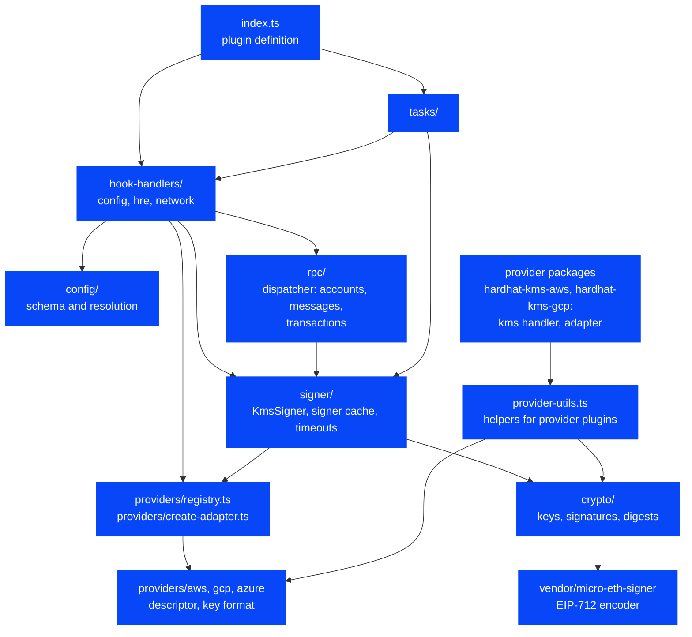
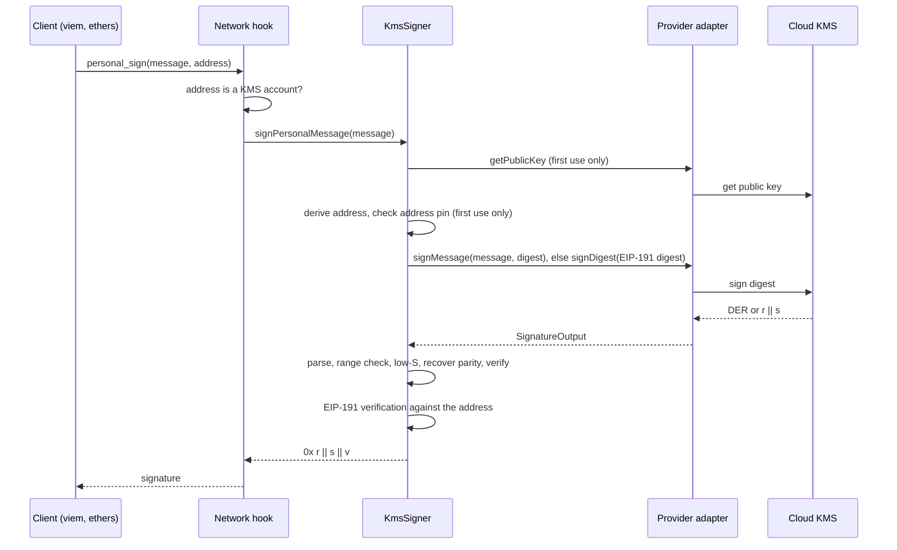
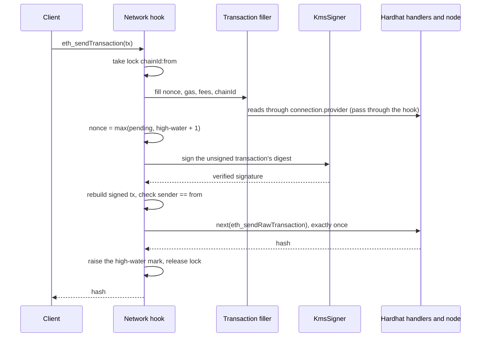

# Architecture

Audience: Contributors and reviewers who want to understand how the code fits together.

Status: M1 implements the signing core (`crypto/`, `signer/`, the vendored EIP-712 encoder). M2 adds `config/`, the built-in providers' descriptors and key formats, the registry and the `kms` hook (`providers/`). M3 adds the AWS adapter, which lives in its own package, `packages/hardhat-kms-aws` ([#91](https://github.com/aelmanaa/hardhat-kms/issues/91)). M4 adds the network hook, the RPC dispatcher for accounts, messages and typed data, and the per-runtime signer cache ([#19](https://github.com/aelmanaa/hardhat-kms/issues/19)). M5 adds the transaction filler ([#23](https://github.com/aelmanaa/hardhat-kms/issues/23)), signing and sending transactions ([#24](https://github.com/aelmanaa/hardhat-kms/issues/24)), and the send guard ([#25](https://github.com/aelmanaa/hardhat-kms/issues/25)). M6 adds the Google Cloud adapter in `packages/hardhat-kms-gcp` ([#29](https://github.com/aelmanaa/hardhat-kms/issues/29)) and the Azure adapter in `packages/hardhat-kms-azure` ([#30](https://github.com/aelmanaa/hardhat-kms/issues/30)). M7 adds the `kms` task namespace. Its tasks so far are `kms accounts` ([#32](https://github.com/aelmanaa/hardhat-kms/issues/32)), `kms address` and `kms public-key` ([#33](https://github.com/aelmanaa/hardhat-kms/issues/33)), `kms sign` ([#34](https://github.com/aelmanaa/hardhat-kms/issues/34)), `kms sign-auth` ([#35](https://github.com/aelmanaa/hardhat-kms/issues/35)), `kms sign-tx` ([#36](https://github.com/aelmanaa/hardhat-kms/issues/36)) and `kms verify` ([#37](https://github.com/aelmanaa/hardhat-kms/issues/37)). The other modules are planned; the code map gives each one's milestone.

## Module map

Each arrow points from a module to a module it may import. Blue modules are implemented. All modules are in `packages/hardhat-kms/src/` except the provider packages, which reach the core only through `hardhat-kms/types` and `hardhat-kms/provider-utils`.



The rules behind the arrows:

- `crypto/` is pure: no cloud SDK, no Hardhat runtime, no I/O. Everything in it is testable with vectors and property tests.
- `signer/` owns every check on the signature itself: parsing, low-S, parity recovery and verification. `KmsSigner` receives an adapter and never looks one up; the signer cache (`signer/key-cache.ts`) creates adapters through `providers/create-adapter.ts`.
- Adapters translate between the provider's wire format and `SignatureOutput`, and run the provider-specific identity checks listed in [Key identity and pinning](signing-pipeline.md#key-identity-and-pinning). They never decide whether a signature belongs to the key.
- The core depends on no cloud SDK. Each provider package depends on its own SDK and imports it only when it creates an adapter (see [SDK loading](#sdk-loading)), so loading a config never loads a cloud SDK.

## Packages

The repository is a pnpm workspace ([decision 0010](decisions/0010-pnpm-workspaces.md)). Following [decision 0009](decisions/0009-one-package-per-provider.md), each cloud provider has its own package around an SDK-free core:

| Package                      | Holds                                                                                                   | Status                                                                 |
| ---------------------------- | ------------------------------------------------------------------------------------------------------- | ---------------------------------------------------------------------- |
| `packages/hardhat-kms`       | The core: config and key formats, signing checks, the `kms` hook, `--kms`, `hardhat-kms/provider-utils` | Implemented                                                            |
| `packages/hardhat-kms-aws`   | The AWS plugin and adapter, depending on `@aws-sdk/client-kms`                                          | Implemented ([#91](https://github.com/aelmanaa/hardhat-kms/issues/91)) |
| `packages/hardhat-kms-azure` | The Azure Key Vault plugin and adapter, depending on `@azure/keyvault-keys` and `@azure/identity`       | Implemented ([#30](https://github.com/aelmanaa/hardhat-kms/issues/30)) |
| `packages/hardhat-kms-gcp`   | The Google Cloud plugin and adapter, depending on `@google-cloud/kms`                                   | Implemented ([#29](https://github.com/aelmanaa/hardhat-kms/issues/29)) |

## Code map

| Concept                                     | Where                                                                                                                                                             | Milestone |
| ------------------------------------------- | ----------------------------------------------------------------------------------------------------------------------------------------------------------------- | --------- |
| Plugin definition                           | `packages/hardhat-kms/src/index.ts`                                                                                                                               | M0        |
| Public keys, signatures, digests            | `packages/hardhat-kms/src/internal/crypto/`                                                                                                                       | M1        |
| Signer and adapter interface                | `packages/hardhat-kms/src/internal/signer/kms-signer.ts`, `packages/hardhat-kms/src/internal/signer/types.ts`                                                     | M1        |
| Per-call timeout                            | `packages/hardhat-kms/src/internal/signer/timeout.ts`                                                                                                             | M1        |
| Error builder                               | `packages/hardhat-kms/src/internal/errors.ts`                                                                                                                     | M1        |
| Vendored EIP-712 encoder                    | `packages/hardhat-kms/src/internal/vendor/micro-eth-signer/`                                                                                                      | M1        |
| Config schema and resolution                | `packages/hardhat-kms/src/internal/config/`                                                                                                                       | M2        |
| Provider descriptors and registry           | `packages/hardhat-kms/src/internal/providers/{registry,types}.ts`, `packages/hardhat-kms/src/internal/providers/*/descriptor.ts`                                  | M2        |
| `kms` hook for provider plugins             | `packages/hardhat-kms/src/internal/providers/create-adapter.ts`, `KmsHooks` in `packages/hardhat-kms/src/types.ts`                                                | M2        |
| Helpers for provider plugins                | `packages/hardhat-kms/src/provider-utils.ts` (`hardhat-kms/provider-utils`)                                                                                       | M3        |
| `--kms` option (Foundry's variables)        | `packages/hardhat-kms/src/internal/config/env-keys.ts`, `packages/hardhat-kms/src/internal/hook-handlers/hre.ts`                                                  | M2, M4    |
| AWS plugin, `kms` hook handler and adapter  | `packages/hardhat-kms-aws/src/index.ts`, `packages/hardhat-kms-aws/src/internal/hook-handlers/kms.ts`, `packages/hardhat-kms-aws/src/internal/adapter.ts`         | M3        |
| Azure plugin, credential chain and adapter  | `packages/hardhat-kms-azure/src/index.ts`, `packages/hardhat-kms-azure/src/internal/{hook-handlers/kms,credential,adapter}.ts`                                    | M6        |
| GCP plugin, `kms` hook handler and adapter  | `packages/hardhat-kms-gcp/src/internal/hook-handlers/kms.ts`, `packages/hardhat-kms-gcp/src/internal/adapter.ts`, `packages/hardhat-kms-gcp/src/internal/wire.ts` | M6        |
| Network hook                                | `packages/hardhat-kms/src/internal/hook-handlers/network.ts`                                                                                                      | M4        |
| Signer cache                                | `packages/hardhat-kms/src/internal/signer/key-cache.ts`                                                                                                           | M4        |
| RPC dispatcher and methods                  | `packages/hardhat-kms/src/internal/rpc/dispatcher.ts` (accounts, messages, typed data, transactions)                                                              | M4, M5    |
| Transaction filler (port of Hardhat 3.18.0) | `packages/hardhat-kms/src/internal/rpc/transaction-filler.ts`                                                                                                     | M5        |
| Transaction signing, EIP-7702 lint          | `packages/hardhat-kms/src/internal/rpc/transactions.ts`                                                                                                           | M5        |
| Send lock, nonce high-water mark, retries   | `packages/hardhat-kms/src/internal/rpc/send-guard.ts`, `sendTransaction` in `packages/hardhat-kms/src/internal/rpc/dispatcher.ts`                                 | M5        |
| User warnings                               | `packages/hardhat-kms/src/internal/warnings.ts`                                                                                                                   | M5        |
| `kms` namespace and task definitions        | `packages/hardhat-kms/src/index.ts`                                                                                                                               | M7        |
| Key lookup and signers for tasks            | `packages/hardhat-kms/src/internal/tasks/keys.ts`                                                                                                                 | M7        |
| `kms address`, `kms public-key`             | `packages/hardhat-kms/src/internal/tasks/{address,public-key}.ts`                                                                                                 | M7        |
| `kms sign`                                  | `packages/hardhat-kms/src/internal/tasks/sign.ts`                                                                                                                 | M7        |
| `kms verify`                                | `packages/hardhat-kms/src/internal/tasks/verify.ts`                                                                                                               | M7        |
| Message and typed-data arguments of tasks   | `packages/hardhat-kms/src/internal/tasks/inputs.ts`, shared by `kms sign` and `kms verify`                                                                        | M7        |
| Typed-data parsing and chain check          | `packages/hardhat-kms/src/internal/rpc/typed-data.ts`, shared by `eth_signTypedData_v4`, `kms sign --data` and `kms verify --data`                                | M4, M7    |
| `kms accounts`                              | `packages/hardhat-kms/src/internal/tasks/accounts.ts`                                                                                                             | M7        |
| `kms sign-tx`                               | `packages/hardhat-kms/src/internal/tasks/sign-tx.ts`                                                                                                              | M7        |
| `kms sign-auth`                             | `packages/hardhat-kms/src/internal/tasks/sign-auth.ts`                                                                                                            | M7        |
| Other tasks                                 | `packages/hardhat-kms/src/internal/tasks/` (planned)                                                                                                              | M7        |

## Signing a message

A `personal_sign` request for a KMS account reaches the provider only after the signer knows the key's address. The signer checks the returned signature twice before the hook answers. The hook half is `packages/hardhat-kms/src/internal/rpc/dispatcher.ts` (M4); the `KmsSigner` half is from M1.



## Sending a transaction

An `eth_sendTransaction` from a KMS account is filled, signed and broadcast by the hook, under the send lock for its chain and address. The signer is held for the fill and the signature only, not for the broadcast. A retry of a request whose broadcast failed skips the fill and the signature and sends the same bytes again (see [Retries after broadcast](transactions.md#retries-after-broadcast)).



The rules that keep this safe are in [Request flow and re-entrancy rules](#request-flow-and-re-entrancy-rules) and in [Transactions](transactions.md).

## Goals

hardhat-kms is an MIT-licensed Hardhat 3 plugin that signs transactions and messages with secp256k1 keys held in cloud KMS and HSM services. Version 1 supports three providers:

- AWS KMS
- GCP Cloud KMS
- Azure Key Vault and Azure Managed HSM

The design has three goals:

1. Existing tooling works unchanged. viem, ethers, Ignition and plain scripts see KMS keys as ordinary accounts, because the plugin works at the JSON-RPC layer through a network hook.
2. Parity with Foundry's KMS support, or better. Every Foundry key form and command has an equivalent, and the plugin adds checks Foundry does not have.
3. A new KMS or HSM is one provider plugin: a package with a `kms` hook handler and an adapter.

Private key material never leaves the KMS. The plugin sends a 32-byte digest (or, for policy-aware providers, the structured request) and gets a signature back. Every signature is then verified locally before anything uses it.

## Module layout

```
packages/hardhat-kms/src/
  index.ts                  definePlugin: types, constants, lazy hook/task imports only (Hardhat plugin guideline)
  type-extensions.ts        augments HardhatUserConfig/HardhatConfig (kms) + Http/Edr Network(User)Config (kmsAccounts); no named exports
  types.ts                  public provider-author types (exported via the "hardhat-kms/types" subpath)
  provider-utils.ts         helpers for provider plugins (the "hardhat-kms/provider-utils" subpath, @experimental)
  internal/
    config/                 zod v3 schema rooted at HardhatUserConfig; conditionalUnionType on `provider`; superRefine for named-key refs
                            (path ["networks", n, "kmsAccounts", i]); pure resolve; key-identity.ts: when two keys are one KMS key
    hook-handlers/
      config.ts             validate/resolve (imports provider *descriptors* only)
      hre.ts                reads --kms when the runtime is created; keeps the keys per runtime
      network.ts            newConnection (default-network warning) / onRequest / closeConnection
    providers/
      registry.ts           provider id -> descriptor; a built-in provider = one folder + its types + one entry here
      create-adapter.ts     runs the `kms` hook chain; a key no handler claims fails; checks the adapter
      aws/ gcp/ azure/      descriptor.ts (zod schema, resolve incl. displayId, name, adapter package or tracking issue)
                            config.ts, key-id.ts (pure: key formats and parsing)
    crypto/                 pure, no SDKs: public-key.ts, signature.ts, address.ts, crc32c.ts
    signer/
      key-cache.ts          SignerCache: per-runtime signers by resolved key config; idle close after the last connection
      kms-signer.ts         signDigest -> {r, s, yParity}: parse -> range -> low-S -> trial recovery -> verify
    rpc/
      dispatcher.ts         request flow (see "Request flow and re-entrancy rules"); ConnectionAccounts;
                            accounts, eth_sign, personal_sign, eth_signTypedData_v4
      typed-data.ts         readTypedData, checkTypedDataChain: shared with kms sign --data
      transactions.ts       fill, sign, rebuild and check a KMS account's transaction; EIP-7702 authorization lint
      transaction-filler.ts port of Hardhat 3.18.0's fill logic; builds the unsigned transaction and its signing hash
      send-guard.ts         process-global send lock; per connection: nonce high-water marks, retry entries,
                            uncertain transactions; SendOutcomeUnknownError
    tasks/                  keys.ts: key lookup by name, signers closed after each run, printLine;
                            inputs.ts: message and --data arguments; one action module per task:
                            accounts, address, public-key, sign, sign-auth, sign-tx, verify
    vendor/micro-eth-signer/  vendored EIP-712 hashing (MIT, see "Vendored EIP-712")
    errors.ts               allow-listed error builder
    warnings.ts             the one console.warn: warnings for the user
    debug.ts                kmsDebug: hardhat:kms:config, providers, signer, rpc; plain values only
```

The plugin object sets `npmPackage: "hardhat-kms"`. The config hook handler imports provider descriptors only, and no descriptor imports an SDK.

Each provider package has the same small layout. For AWS:

```
packages/hardhat-kms-aws/src/
  index.ts                  definePlugin: id and npmPackage "hardhat-kms-aws", depends on hardhat-kms,
                            lazy `kms` hook handler import; references "hardhat-kms/types" for the config types
  internal/
    hook-handlers/kms.ts    claims `aws` keys, passes other keys to next; imports the adapter and the SDK on first use
    adapter.ts              createAwsKeyAdapter(key, sdk): GetPublicKey, Sign, key spec checks, ARN pinning
```

`packages/hardhat-kms-azure` follows it, with one more module, `internal/credential.ts`, which builds the credential chain that all Azure keys of a runtime share. Its handler loads `@azure/keyvault-keys`, `@azure/identity`, the credential module and the adapter together, once per runtime. Key Vault's formats need no module of their own: the public key is a JWK, which `publicKeyFromJwk` in `hardhat-kms/provider-utils` reads, and signatures are 64 bytes `r || s`, which the core parses. `packages/hardhat-kms-gcp` follows it too, with a pure `wire.ts` that reads the CRC32C checksums and the gRPC status codes of Google Cloud's responses.

## Request flow and re-entrancy rules

The dispatcher follows these rules. They keep the hook from deadlocking on its own internal calls and make each request's side effects easy to reason about.

1. Pass-through is the default. Only `eth_accounts`, `eth_requestAccounts` and the five signing methods are inspected. Everything else goes straight to `next`, so no allow-list of other methods is needed. A signing method that passes through comes back as the rest of the chain answered it, with one exception: an "unknown account" error gets the KMS addresses appended (`passThrough` and `isUnknownAccount` in `packages/hardhat-kms/src/internal/rpc/dispatcher.ts`). The thrown error's `message` and `stack`, and a `HardhatError`'s `formattedMessage` (the text Hardhat's CLI prints), are changed in place, so its class, `code`, `data` and Hardhat error number stay. If one of those writes fails, as on a frozen error, the others are undone and the error is rethrown as it came. An error that already carries the list is left alone, and an error answer is copied with the new message.
2. `next` is called at most once per request. Every internal RPC call (for example the reads during fill) goes through `connection.provider.request`, which re-enters the hook chain and is passed through by rule 1.
3. Per-runtime and per-connection state (`SignerCache`, `ConnectionAccounts`) is memoised as promises, with no lock. A failed promise is dropped, so the next request retries.
4. `eth_sendTransaction` for KMS address `a` on chain `c` takes the process-global lock `c:a`. Inside the lock the code may issue read calls (fill), make any number of KMS signature attempts (retries), and make exactly one `next(eth_sendRawTransaction)`.
5. `eth_signTransaction` takes no lock and never touches the nonce high-water mark, because it never broadcasts.

## Other signing plugins

Hardhat runs dynamically registered handlers first, then plugins in reverse order of the `plugins` array, and its built-in handlers last. Another plugin that intercepts `eth_accounts` or `eth_sendTransaction`, such as `@nomicfoundation/hardhat-ledger`, therefore runs before or after hardhat-kms depending on where each appears in `plugins`. A provider package such as `hardhat-kms-aws` depends on hardhat-kms, so Hardhat places hardhat-kms just before it.

hardhat-kms only acts on addresses it owns and passes everything else on. hardhat-ledger also passes requests for other addresses on, but only after it has validated their params: `LedgerHandler.handle` runs `validateParams` on `personal_sign`, `eth_sign`, `eth_signTypedData_v4` and `eth_sendTransaction` before it checks who owns the address. `packages/hardhat-kms/test/integration/ledger.test.ts` checks both orders. The order has three effects:

- `eth_accounts`: each plugin appends its addresses to the list the rest of the chain returns, so the plugin whose hook runs first lists its addresses last. With `plugins: [hardhatKms, hardhatLedger]`, a network lists its own accounts, then the KMS addresses, then the Ledger addresses; the other order swaps the last two groups. Code that picks an account by index, such as Ignition's `m.getAccount(index)`, sees the difference.
- `eth_requestAccounts`: hardhat-ledger passes it on unchanged, and hardhat-kms answers it by asking the rest of the chain for `eth_accounts`. The Ledger addresses are listed only when hardhat-ledger comes first in `plugins`, so that its hook runs after hardhat-kms's.
- Transactions without `from`: Hardhat sets the default sender in its built-in handlers, after both plugins. When hardhat-ledger's hook runs first, its schema requires `from`, so it rejects the transaction with a `ZodError` before hardhat-kms sees it, as it does when loaded alone. When hardhat-kms's hook runs first, hardhat-kms sets the default sender (see [Sender resolution](transactions.md#sender-resolution)), and the transaction goes on with `from` set.

The user documentation therefore recommends listing hardhat-ledger first ([Other signing plugins](../user/reference/configuration.md#other-signing-plugins)).

## Tasks

The plugin definition declares `emptyTask("kms")` and one `task(["kms", <name>])` per task, each with `setAction(() => import(...))`, as hardhat-keystore does. Defining the tasks loads no action module and no SDK. The SDK-loading tests in the provider packages check both, and that running `kms address`, `kms public-key`, `kms sign-tx` and `kms verify --key` on another provider's key, or `kms accounts` on the other providers' keys, loads no SDK.

Every task that takes a key uses `packages/hardhat-kms/src/internal/tasks/keys.ts`:

- `taskKeys(hre)` lists the keys a task can name, each once: `kms.keys`, then the inline keys of each network's `kmsAccounts`, then the `--kms` keys from `commandLineKeys(hre)`. Each `TaskKey` has the key's `name`, its `source` (`"kms.keys"`, `"kmsAccounts"` or `"--kms"`) and the resolved `key`.
- `findTaskKey(hre, name)` returns the key with that name. An unknown name fails with the known names, and suggests one that differs only in case. A name that more than one key has, such as a `kms.keys` key and a `--kms` key, fails with their sources.
- `withTaskSigners(hre, use)` gives `use` a `signerFor(key)` function backed by a new `SignerCache`, and closes every signer in a `finally`. A task run therefore never shares the network hook's signers, and the process exits once the task returns. The cache's display function writes adapters' status messages to standard error with `printNote`; the network hook's cache keeps Hardhat's `interruptions.displayMessage`, which prints to standard output. `withNamedSigner(hre, name, use)` combines it with `findTaskKey` for single-key tasks.
- `printLine(line)` writes the result to standard output, and `printNote(line)` writes a note to standard error, prefixed with `[hardhat-kms]`.

`kms address` uses `KmsSigner.confirmedAddress()`, which, unlike `getAddress()`, asks an address-only adapter even when the key has a pin, and says when the address is an unchecked pin. An action module's default export is a `NewTaskActionFunction`. It prints its result with `printLine` and also returns it, so `hre.tasks.getTask(["kms", "address"]).run({ key })` gives the value to scripts and tests. Errors are `kmsError`s, which the CLI prints and turns into exit code 1. The key's argument is the positional argument `key`, described by `KEY_ARGUMENT_DESCRIPTION` in `index.ts`. The user-facing rules are in the [tasks reference](../user/reference/tasks.md).

`kms sign` checks its input before it opens a signer. Typed data goes through `readTypedData` and `checkTypedDataChain` in `rpc/typed-data.ts`, the functions `eth_signTypedData_v4` uses, and the chain to compare with is `--chain`, else the `chainId` in the `--network` config. Only a network config without `chainId` makes the task open a connection to read `eth_chainId`; creating it runs the network hook, which can call the KMS, since Hardhat funds an `edr-simulated` network's accounts then. After signing, the task recovers the address from the printed `r || s || v` and refuses a signature that does not recover to the key. That catches a substituted or wrong signer output. It is no independent check of the digest: the task computes the digest with the signer's own code.

`kms sign-auth` also checks its flags, the delegate, `--chain` and `--nonce` before it opens a signer, and refuses chain 0 without `--force` before any KMS call. It opens a connection only when the command line and the `--network` config leave something to read: `eth_getTransactionCount` with `pending` for the authority's nonce, or `eth_chainId` when the config sets no `chainId`. The connection opens once, on first use, and closes in a `finally`. The task signs `authorizationDigest` from `crypto/digests.ts` with `signDigest` and builds the JSON tuple. It then reads the tuple back, computes the digest again from its fields, and refuses it unless the authority recovered from it is the key's address and `s` is low. That covers the step from signature to printed output as well as a substituted signature. It is no independent check of the digest: the task computes the digest with the same `authorizationDigest` it signs. Before the KMS call, the task writes a summary line to standard error (authority, chain and its source, nonce, delegate), and with an open connection it warns when `eth_getCode` finds no code at the delegate.
`kms sign` and `kms verify` read their message the same way, through `tasks/inputs.ts`: `readMessage` decodes `0x` hex or UTF-8, and `readTypedDataArgument` reads `--data` JSON, from the file with `--from-file`, through `readTypedData`. `kms verify` checks every input before it contacts the KMS, then parses the signature with `parseRpcSignature` in `crypto/signature.ts`, which reads `v` and folds a high-S signature to low S as alloy does, and recovers the address with `recoverAddress`. With `--key`, it gets the key's address with `confirmedAddress()`, as `kms address` does; with `--address`, it opens no signer. A mismatch returns Hardhat's `errorResult`, which the CLI turns into exit code 1 without printing an error.

`kms accounts` takes no key. It lists `taskKeys(hre)`, or, with `--network`, that network's `kmsAccounts` followed by `commandLineKeys(hre)`, and resolves every key with `confirmedAddress()` inside one `withTaskSigners`, at most `ACCOUNTS_CONCURRENCY` (8) keys at a time. Without `--network`, keys with the same `keyIdentity()` and the same pin are listed once, and the row keeps every merged entry's name and source, so each config entry gets its pin line. With `--network`, the same function finds a `--kms` key that repeats a network entry, for a note. `keyIdentity()` lives in `packages/hardhat-kms/src/internal/config/key-identity.ts` and is the same function the dispatcher uses to refuse a `--kms` key that repeats a config key. A key's failure is caught and kept in its entry, so one key cannot hide the others. The task returns a Hardhat `Result` from `hardhat/utils/result`; the CLI sets exit code 1 for a failed one without printing an error. The report's types, `AccountsReport` and `AccountEntry`, are exported from `hardhat-kms/types`, and the report carries `version: 1`.

`kms sign-tx` signs with the code that signs `eth_signTransaction`. It opens a connection to the `--network` network with `hre.network.create`, builds a `ConnectionChain` with `createConnectionChain` and a filler with `createTransactionFiller`, as the network hook does for each connection, and calls `signTransaction` with the task's signer. Its fill reads go through `connection.provider` and the hook chain, so the key does not need to be one of the network's accounts. The task's own checks come before the KMS signs: `--network` is set, the file is one JSON object, every field is an `eth_sendTransaction` field or `type`, quantities are `0x` hex, mixed-case addresses carry a valid EIP-55 checksum, and `from`, when set, is the key's address. A requested `type` is compared with the built transaction through `signTransaction`'s `checkUnsigned` option, before the KMS signs. The task closes its connection and prints the raw transaction to standard output, as `cast mktx` does, and the hash to standard error with `printNote`; it has no code path that sends either. `KNOWN_FIELDS` comes from a `Record<keyof RpcTransactionRequest, true>`, so the compiler keeps it equal to Hardhat's request type, and a test pins it to the runtime schema's keys.

## Lifetimes and caching

The network hook's factory runs once per runtime. Its closure holds a `SignerCache` (`packages/hardhat-kms/src/internal/signer/key-cache.ts`), so every connection of the runtime shares the same signers, and an address is looked up once. The cache is keyed by the resolved key config object, by identity. It does not deduplicate by provider and canonical key id: two key entries that name the same KMS key, such as a named key and an inline key, get two signers. On one network, the dispatcher then refuses them as the same account. A connection created with an `override` resolves the config again, so it gets new key objects and new signers ([#105](https://github.com/aelmanaa/hardhat-kms/issues/105)). A signer that fails to open is not cached.

Each connection with KMS keys gets a `ConnectionAccounts` (`packages/hardhat-kms/src/internal/rpc/dispatcher.ts`), which maps its addresses to keys. Its lookups run in parallel on first use, and a failed lookup is not cached. A connection also gets one `ConnectionChain`, on its first KMS transaction one `TransactionFiller`, and on its first KMS send one `ConnectionSends` (its nonce high-water marks and retry entries), each held in a WeakMap keyed by the connection. Closing the connection drops the filler and the send state, and cancels the retry entries' timers. The send lock is process-global, keyed by chain id and address, and holds no state once its queue is empty.

The cache counts connections that have KMS keys. Five seconds after the last of them closes, an `unref`'d idle timer closes the signers, and with them the adapters and SDK clients; the next use creates them again. A connection that opens before the timer fires cancels it, and a connection closed twice is counted once. While a request is still signing, the idle close waits and tries again, so the request keeps its SDK client. Because the timer is `unref`'d and nothing else holds the event loop, a script that signs and never closes its connection still exits. `packages/hardhat-kms-aws/test/integration/network.test.ts` checks this with `packages/hardhat-kms-aws/test/fixtures/sign-and-exit.ts`. The GCP adapter creates its client with `{ fallback: true }` (REST), so no gRPC channel keeps `hardhat run` alive; `packages/hardhat-kms-gcp/test/integration/network.test.ts` runs the same exit check with `packages/hardhat-kms-gcp/test/fixtures/sign-and-exit.ts`.

Status messages from adapters go to Hardhat's `interruptions.displayMessage` with the title `hardhat-kms`.

## Timeouts and retries

One AbortSignal timeout covers each whole KMS call, including the SDK's own retries. The default is 30 s (`kms.defaults.timeoutMs`, overridable per key). For GCP the adapter passes the key's timeout as gax's `timeout` call option, the deadline of each request, with `retry: null`, which turns the SDK's retries off. google-gax enforces that deadline over REST only from 6.5.0, and `@google-cloud/kms` 6.2.1 accepts any 6.x, so `hardhat-kms-gcp` depends on `google-gax` `^6.5.0` itself and passes it to the client's constructor; the client then runs on that copy even if `@google-cloud/kms` resolves an older one. The client's methods return plain promises, so a request already sent cannot be cancelled: after the AbortSignal fires, the request in flight ends at its deadline, and the adapter starts no other.

Signing has no side effects, so calls can be repeated. The AWS SDK retries transient errors itself within that timeout. The GCP adapter has its own loop instead: it repeats a call whose CRC32C check fails, whose digest Cloud KMS refuses for its checksum, or that fails with UNAVAILABLE (after 100, 200 and 400 ms), at most three times (`MAX_RETRIES` in `packages/hardhat-kms-gcp/src/internal/adapter.ts`), and stops once the AbortSignal fires. Its pauses use timers that are not `unref`'d: a signature in progress waits on them, so an `unref`'d pause would let Node exit in the middle of `hardhat run`. Only idle and cleanup timers, such as the signer cache's idle close and the retry entries' expiry, and the core's per-call deadline, which races a request that holds its own socket, are `unref`'d.

## SDK loading

Each provider package lists its cloud SDK in `dependencies`: `hardhat-kms-aws` depends on `@aws-sdk/client-kms` `^3.1143.0`, `hardhat-kms-gcp` on `@google-cloud/kms` `^6.2.1` and `google-gax` `^6.5.0`, and `hardhat-kms-azure` on `@azure/keyvault-keys` `^4.10.2` and `@azure/identity` `^4.13.3`. Installing the package installs the SDK. The core depends on no cloud SDK, and `packages/hardhat-kms/test/unit/plugin.test.ts` fails if its `package.json` lists one.

A provider package imports its SDK only when it creates an adapter: its plugin definition registers the `kms` hook handler as a lazy import, and the handler loads the SDK on first use. The handler, `packages/hardhat-kms-aws/src/internal/hook-handlers/kms.ts`, passes keys of other providers to `next`. For an `aws` key it imports `adapter.ts` and `@aws-sdk/client-kms` with dynamic `import()`, then calls `createAwsKeyAdapter(key, sdk)`. The adapter receives the SDK as an argument typed `AwsKmsSdk`, so unit tests pass a fake.

The core's only peer dependency is `hardhat`. A provider package has two: `hardhat` and `hardhat-kms`, so a project has a single copy of the core. The core and the provider packages are released together at the same version, as a changesets `fixed` group, and a provider package's `hardhat-kms` peer is that exact version. Hardhat's peer-dependency checker ignores `peerDependenciesMeta`, so a provider package cannot be an optional peer of the core. Users install the provider packages they need, as the [configuration reference](../user/reference/configuration.md#provider-packages) documents.

The SDK range is a caret range that starts at a version the tests run. CI tests the version in `pnpm-lock.yaml`, and the SDK floors workflow tests the lowest version the range allows (see [Testing](testing.md)).

`packages/hardhat-kms-aws/test/integration/sdk-loading.test.ts` runs `packages/hardhat-kms-aws/test/fixtures/load-config.ts` in a child process. The fixture loads `hardhat-kms-aws` and resolves a config with a key for every built-in provider. `packages/hardhat-kms-aws/test/helpers/import-recorder.mjs` records the file URL of every module the process loads: through `module.registerHooks` where Node has it, which also sees `require`, and otherwise through asynchronous hooks plus the CommonJS module cache at exit. The test fails if any file under `@aws-sdk/`, `@smithy/` or `@aws-crypto/` is among them. A positive control also creates the AWS key's adapter, with both hook kinds, and must record `@aws-sdk/client-kms`. `packages/hardhat-kms-gcp/test/integration/sdk-loading.test.ts` does the same for `@google-cloud/`, `google-gax`, `google-auth-library`, `gaxios`, `@grpc/` and `protobufjs`.
