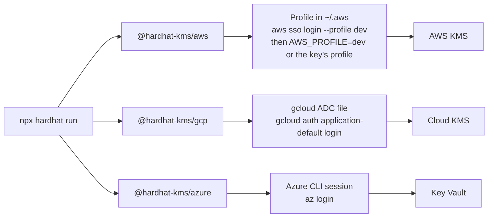
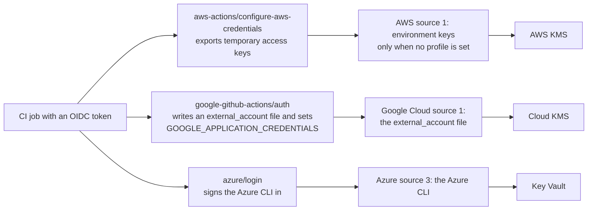
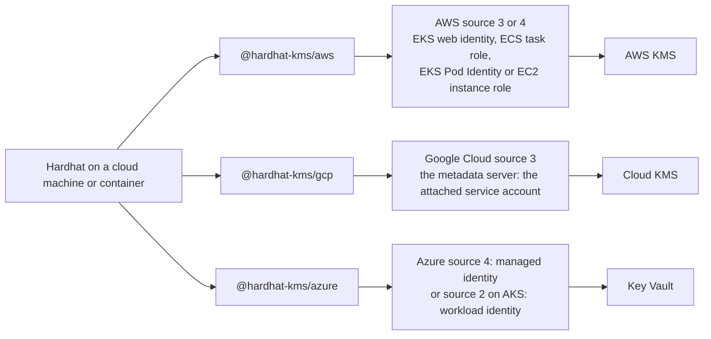
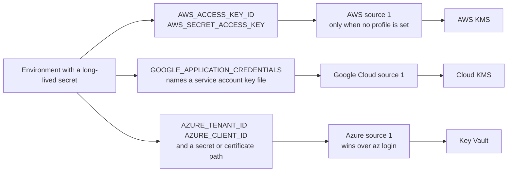

# How the plugin reaches your cloud

Audience: users who want to know which identity signs when they run Hardhat with a KMS key, on a laptop, in CI or on a server. Assumes a key created with one of the setup guides; no experience with cloud credentials and no knowledge of the plugin's code.

Your Hardhat config holds no secrets. It names keys, not credentials. When a key is first used, the provider package for its cloud asks that cloud's own SDK for credentials, and the SDK tries a fixed list of sources in order. The first source that is set up wins. A source is set up when the variables or files it reads exist, such as `AWS_PROFILE` or the file that `gcloud auth application-default login` writes. Your config can change that list in one place only: an AWS key's `profile`.

So the identity that signs depends on where Hardhat runs and on what your environment holds. The same config can sign as you on a laptop, as a CI job's role in CI, and as a machine's identity on a server.

## Which source wins

Each table lists one cloud's sources in the order they are tried. The [configuration reference](../reference/configuration.md#credentials) lists every variable and edge case.

**AWS**, through the AWS SDK for JavaScript:

| Order | Source                                                             | Set up by                                                          |
| ----- | ------------------------------------------------------------------ | ------------------------------------------------------------------ |
| 1     | Access keys in the environment. Skipped whenever a profile is set. | `AWS_ACCESS_KEY_ID`, `AWS_SECRET_ACCESS_KEY`, `AWS_SESSION_TOKEN`  |
| 2     | A profile in `~/.aws/config` and `~/.aws/credentials`              | The key's `profile`, else `AWS_PROFILE`, else `default`            |
| 3     | A web identity token                                               | `AWS_WEB_IDENTITY_TOKEN_FILE` and `AWS_ROLE_ARN`, as EKS sets them |
| 4     | Container credentials, else the EC2 instance role                  | An ECS task role or EKS Pod Identity; an instance role on EC2      |

**Google Cloud**, through Application Default Credentials (ADC):

| Order | Source                                                      | Set up by                                                                                |
| ----- | ----------------------------------------------------------- | ---------------------------------------------------------------------------------------- |
| 1     | The JSON file named by `GOOGLE_APPLICATION_CREDENTIALS`     | A workload identity federation file that a CI step writes, or a service account key file |
| 2     | The gcloud ADC file, `application_default_credentials.json` | `gcloud auth application-default login`                                                  |
| 3     | The metadata server                                         | The service account attached to a VM, GKE workload or Cloud Run service                  |

**Azure**, through a list the plugin builds itself:

| Order | Source                                      | Set up by                                                                                          |
| ----- | ------------------------------------------- | -------------------------------------------------------------------------------------------------- |
| 1     | A service principal in the environment      | `AZURE_TENANT_ID`, `AZURE_CLIENT_ID`, and `AZURE_CLIENT_SECRET` or `AZURE_CLIENT_CERTIFICATE_PATH` |
| 2     | Workload identity                           | `AZURE_TENANT_ID`, `AZURE_CLIENT_ID` and `AZURE_FEDERATED_TOKEN_FILE`, as AKS sets them            |
| 3     | The Azure CLI, then the Azure Developer CLI | `az login`, the `azure/login` GitHub Action, or `azd auth login`                                   |
| 4     | A managed identity                          | Code that runs on Azure; `AZURE_CLIENT_ID` picks a user-assigned one                               |

Three rules decide which identity signs:

- **A source that is set up but fails can end the search.** A `GOOGLE_APPLICATION_CREDENTIALS` that names a missing file fails the run; it does not fall back to your gcloud login. An Azure service principal with a wrong secret fails the run; it does not fall back to `az login`.
- **An AWS profile turns off the access keys in the environment.** With the key's `profile` or `AWS_PROFILE` set, today's AWS SDK ignores `AWS_ACCESS_KEY_ID` and `AWS_SECRET_ACCESS_KEY`, and prints a warning when both are set. Never set both: see [Never set a profile and environment keys together](../reference/configuration.md#aws).
- **Only AWS keys can choose their credentials.** Each AWS key can name its own `profile`. Every Google Cloud key of a run signs as the one ADC identity, and every Azure key as the first Azure source that returns a token. To sign as two identities on those clouds, run Hardhat twice with different environments.

## Common setups

Each diagram shows the source that each cloud uses in that setup. A source higher in the list still wins when it is set up too, so keep the environment of each setup to what the diagram shows.

### Laptop

You sign in with your cloud's command-line tool, and the plugin uses that sign-in.

- AWS: the profile is source 2. Keep `AWS_ACCESS_KEY_ID` and `AWS_SECRET_ACCESS_KEY` out of the laptop's environment, so the profile still signs if a later AWS SDK version starts to prefer environment keys.
- Google Cloud: the ADC file is source 2. `gcloud auth login` alone is not enough, since the plugin does not use the gcloud CLI's own account. Check that `GOOGLE_APPLICATION_CREDENTIALS` is not set in your shell, or it wins.
- Azure: the Azure CLI is source 3. Check that `AZURE_CLIENT_SECRET` and `AZURE_CLIENT_CERTIFICATE_PATH` are not set, or a service principal wins, and that `AZURE_FEDERATED_TOKEN_FILE` is not set, or workload identity wins. With `AZURE_TENANT_ID` and `AZURE_CLIENT_ID` set, `AZURE_USERNAME` and `AZURE_PASSWORD` must not both be set either: the plugin then refuses to run rather than sign in with a password.

### CI with OIDC

The CI job proves its identity to the cloud with a short-lived OpenID Connect (OIDC) token from the CI system, and gets short-lived credentials back. No long-lived secret is stored. These are the GitHub Actions steps; other CI systems have equivalents.

- AWS: the action exports the keys, so the job must not set a profile: no `AWS_PROFILE`, and no `profile` value in the config when CI runs. A `profile` read from a configuration variable that CI leaves empty is fine; see [One config for a laptop and CI](../guides/aws-kms-setup.md#one-config-for-a-laptop-and-ci).
- Google Cloud: the `external_account` file holds no key, only where to exchange the CI token.
- Azure: `azure/login` sets no `AZURE_*` variables; the plugin gets its token from the Azure CLI that the action signed in.

### Server, VM or container

Code that runs in the cloud uses the identity the cloud attaches to the machine, container or pod, so no long-lived credential file is needed. Some sources still read a short-lived token from a file: EKS web identity reads the token file that EKS mounts in the pod.

- AWS: on EC2, require IMDSv2 on the instance; the [configuration reference](../reference/configuration.md#aws) explains why.
- Azure: the managed identity has 10 seconds to return a token. Outside Azure it is never reached when the Azure CLI is signed in, since the CLI comes first.

### Long-lived secret in the environment

A long-lived secret sits in the environment or in a file: AWS access keys, a Google service account key file, or an Azure service principal's secret or certificate. It works anywhere, and it comes first in every list, except that on AWS a profile turns it off. Each cloud advises against long-lived secrets where the setups above are possible.

- AWS: prefer a role, through SSO on a laptop or OIDC in CI. Long-lived access keys are the AWS case to avoid.
- Google Cloud: Google recommends against service account key files, and new organizations block creating them by default. [Set up a Google Cloud KMS key](../guides/gcp-kms-setup.md#2-allow-signing-and-nothing-else) lists the alternatives.
- Azure: prefer a certificate to a secret, and a federated credential to both. [Set up an Azure Key Vault key](../guides/azure-key-vault-setup.md#3-sign-in) quotes Microsoft's advice. The plugin never signs a user in with `AZURE_USERNAME` and `AZURE_PASSWORD`.

## What the plugin adds to the SDKs

The plugin passes no credentials to the AWS and Google Cloud SDKs, so their lists above are the SDKs' own. It adds three things:

- On AWS, it passes a key's `region`, `profile` and `endpoint` to the client. Keys with different settings get their own client.
- On Azure, it builds the list itself, in the order proposed for Foundry's Azure Key Vault signer ([Comparison with Foundry](foundry-comparison.md#credentials) has the details). It skips sources that are not set up, refuses username and password sign-in, and shares one token per run between all Azure keys.
- On AWS and Google Cloud, it closes its clients five seconds after the last network connection that uses KMS keys closes (in a script, `network.create()` returns one), and the next request looks the credentials up again. On Azure, the run keeps its token and asks for a new one five minutes before it expires.

[`kms history`](../reference/tasks.md#kms-history) reads the audit logs with the same identity that signs.

## Read next

- [Configuration reference: Credentials](../reference/configuration.md#credentials): every variable each source reads.
- The setup guides, which say which identity to grant access: [AWS KMS](../guides/aws-kms-setup.md), [Google Cloud KMS](../guides/gcp-kms-setup.md), [Azure Key Vault](../guides/azure-key-vault-setup.md).
- [Comparison with Foundry](foundry-comparison.md#credentials): how Foundry finds credentials on each cloud.
- Optional, for contributors: [Cloud access and credentials](../../contributor/architecture.md#cloud-access-and-credentials) in the architecture docs, with the code and SDK lines behind each step.
