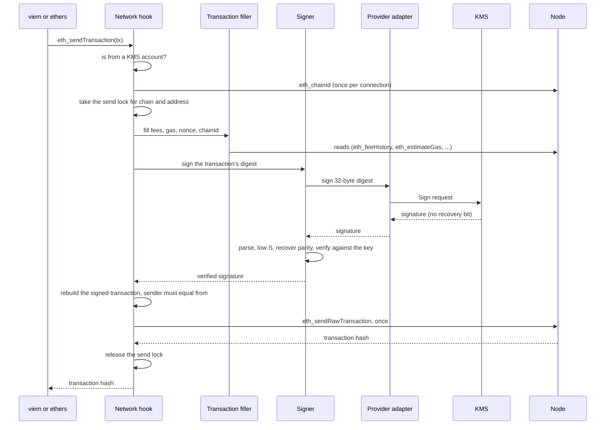

# How hardhat-kms works

Audience: users who send transactions or sign messages from a KMS account with viem, ethers or Ignition, and want to know what happens between their call and the chain. Assumes a configured key; no knowledge of the plugin's code.

Status: Implemented. Everything below is on `main`. For the code behind each step, see [Architecture](../../contributor/architecture.md).

hardhat-kms works at Hardhat's JSON-RPC layer. viem's wallet clients from hardhat-viem and the ethers signers from hardhat-ethers do not sign a KMS account's transaction themselves: they send it to the network connection as an `eth_sendTransaction` request, as they would for any account the node manages. The plugin's network hook picks up that request, has the KMS sign it, checks the signature, and sends the signed transaction to the node. Your script sees an ordinary account and gets an ordinary transaction hash back.

## The path of one transaction

The diagram follows one `eth_sendTransaction` from a KMS account: the hook reads the chain id and takes the send lock, the filler completes the transaction, the KMS signs its 32-byte digest, the signer checks the signature, and the hook broadcasts the result once.

Each step in turn:

1. Your call becomes a request. `viem.deployContract`, `contract.write.add`, `ethers.deployContract` or `counter.add` all end in `eth_sendTransaction` on the connection from `network.create()`. The [examples](../../../examples/README.md) do exactly this.
2. The network hook sorts the request. On a network without KMS keys, every request passes straight through. Otherwise the hook inspects only `eth_accounts`, `eth_requestAccounts` and five signing methods, and only acts when the address is one of your KMS accounts. A transaction without `from` first gets the sender Hardhat would give it, so a transaction from a KMS address never reaches the node unsigned. On first use, the hook also learns the connection's KMS addresses: a key with an `address` pin needs no KMS call, and a key without one gets a public-key lookup here. The [RPC methods reference](../reference/rpc-methods.md) lists the rules.
3. The send lock serializes sends. The hook reads the node's chain id with `eth_chainId` first, because the lock is keyed by chain and address. Sends from one KMS address on one chain run one after the other, in the order they arrive. Ten parallel `sendTransaction` calls from one account on one connection therefore get ten consecutive nonces. The lock covers the whole Hardhat process, not other processes. If an earlier send from the account got no answer from the node, the hook asks the node about it with `eth_getTransactionByHash` while holding the lock, before choosing the next nonce.
4. The filler completes the transaction. It fills fees, gas, the nonce and the chain id the way Hardhat fills a transaction for one of its local accounts, reading what it needs from the node. The transaction's chain id must equal the node's `eth_chainId`, and the network's `chainId` when your config sets one. Unless you set the nonce yourself, it is the node's pending count, or one above the last nonce this connection sent from the account, whichever is higher. On simulated networks the node's pending count alone decides.
5. The signer asks the KMS. Before the key's first signature, the signer has its public key, from step 2 or now for a pinned key, and checks the derived address against your `address` pin, if you set one. Then the adapter for your provider sends the transaction's 32-byte digest to the KMS: AWS KMS gets a `Sign` request with `MessageType: DIGEST`, Google Cloud KMS an `asymmetricSign` request with a CRC32C checksum, and Azure Key Vault a sign request with `ES256K`. The private key stays in the KMS. Each call has a time limit, 30 s by default (`timeoutMs`).
6. The signer checks the signature. KMS services return a signature without the recovery bit Ethereum needs, sometimes with a high `s`. The signer parses it strictly, folds `s` to its low form, works out the recovery bit by recovering the public key it already knows, and verifies the result. A signature that fails one of these checks gets one fresh attempt, then an error.
7. The hook checks the transaction. It puts the signature into the transaction and recovers the sender. If the sender is not `from`, nothing is sent.
8. The hook broadcasts once. It sends the signed bytes to the node as `eth_sendRawTransaction`, exactly once, and returns the node's answer: the transaction hash, or the node's error unchanged. If the node does not answer at all, the plugin returns an error with code `-32000` that carries the transaction hash, so you can look the transaction up. The [RPC methods reference](../reference/rpc-methods.md#parallel-sends-and-failed-broadcasts) covers what happens when a client retries such a send.

## Other requests

The other requests take shorter paths through the same parts:

| Request                | What the plugin does                                                                                                                                                                                     |
| ---------------------- | -------------------------------------------------------------------------------------------------------------------------------------------------------------------------------------------------------- |
| `eth_accounts`         | Returns the network's own accounts, then the KMS addresses. An address comes from its `address` pin without a KMS call, or from a public-key lookup on first use.                                        |
| `personal_sign`        | Signs the EIP-191 message (with its prefix) through steps 5 and 6, then checks the result again with an EIP-191 verifier. No lock and no node call.                                                      |
| `eth_sign`             | The same as `personal_sign`, with the parameters in the other order.                                                                                                                                     |
| `eth_signTypedData_v4` | Checks the typed data's `domain.chainId` against the node's chain when the data names one, then signs through steps 5 and 6 and checks the result with an EIP-712 verifier.                              |
| `eth_signTransaction`  | Steps 2, 4, 5, 6 and 7, then returns the signed transaction as hex. It takes no lock and sends nothing. The [`kms sign-tx`](../reference/tasks.md#kms-sign-tx) task does the same from the command line. |
| Any other method       | Passes through to Hardhat and the node untouched.                                                                                                                                                        |

No RPC method signs a bare 32-byte digest that the caller supplies; the [security model](security-model.md#guarantees) explains why.

## Keys, connections and the KMS client

The plugin talks to the KMS only when a request needs it. Loading the config makes no KMS call and loads no cloud SDK; a provider's SDK loads when the plugin first sets up one of its keys. On a simulated network with `kms.simulatedBalance`, a new connection funds the KMS accounts, so it looks up their addresses.

All connections in one Hardhat run share one signer per configured key, so each key's address is looked up once. Five seconds after the last connection with KMS keys closes, the plugin closes the signers and their SDK clients; the next request opens them again. A script that never closes its connection still exits, because that timer does not keep Node.js running.

## Read next

- [Security model](security-model.md): what these checks protect against, what they do not, and what happens when a KMS call times out.
- [Architecture](../../contributor/architecture.md): the modules, the code map and the request-flow rules, for contributors.
- [Transactions](../../contributor/transactions.md): the filler, nonces, the send lock and retries in detail.
- [Debug output](../guides/debug-output.md): watch each step of a request with `DEBUG=hardhat:kms:*`.
